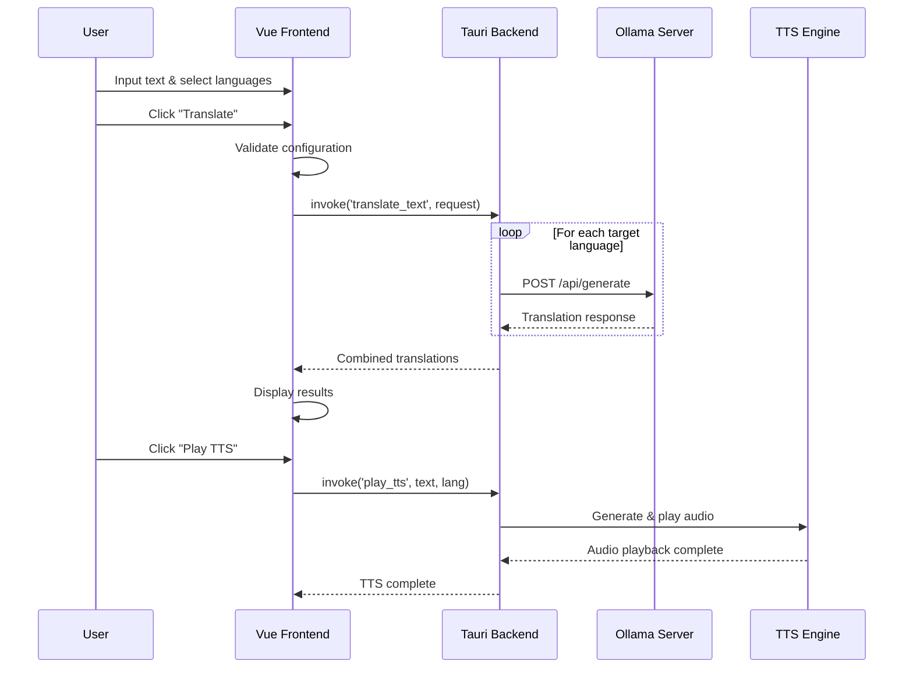

# Alouette - AI Translation & Text-to-Speech Tool

A cross-platform translation and text-to-speech application built with **Tauri v2 + Vue 3 + Rust**, supporting remote Ollama AI servers for high-quality multilingual translation and intelligent speech synthesis.


## 🚀 Environment Setup & Installation

### System Requirements

- **Node.js**: 18+
- **Rust**: 1.70+
- **Ollama Server**: Local or remote Ollama service

### Linux (Ubuntu/Debian)

```bash
# Install system dependencies
sudo apt update && sudo apt install -y \
  libwebkit2gtk-4.1-dev libjavascriptcoregtk-4.1-dev libgtk-3-dev \
  libsoup-3.0-dev libssl-dev libayatana-appindicator3-dev librsvg2-dev \
  build-essential clang llvm-dev libclang-dev python3-pip \
  espeak-ng flite

# Install Edge TTS (premium neural voices)
pip3 install --use-pep517 edge-tts

# Install project dependencies and run
npm install
npm run dev
```

### macOS

```bash
# Install Xcode Command Line Tools
xcode-select --install

# Install TTS engines (at least one is required)
brew install espeak-ng espeak

# (Optional) Install Edge TTS for premium neural voices
pip3 install --use-pep517 edge-tts

npm install -g @tauri-apps/cli
npm install --save-dev vite
npm run build
cd src-tauri && cargo build

# Install and run
npm install
npm run dev
```

### Windows

```bash
# Install Visual Studio Build Tools first
# Download: https://visualstudio.microsoft.com/visual-cpp-build-tools/

# Install Edge TTS
pip install --use-pep517 edge-tts

# Install and run
npm install
npm run dev
```

## ⚙️ Configuration

### Ollama Server Setup

1. Start the app and click **"⚙️ Settings"**
2. Enter Ollama server URL:
   - Local: `http://localhost:11434`
   - Remote: `https://your-domain.com:11434`
3. Test connection, select model, and save

## 🏗️ System Architecture

### TTS Engine Strategy

**Hybrid TTS System** with intelligent fallback:

1. **Edge TTS** (Primary) - Premium neural voices, requires internet
2. **espeak-ng** (Fallback) - Local synthesis, 80+ languages
3. **flite** (Backup) - Lightweight local engine

### Tech Stack

- **Frontend**: Vue 3.5 + Vite 6
- **Backend**: Tauri 2.2 + Rust
- **AI Service**: Ollama with Qwen2/Llama3.2 models
- **TTS**: Edge TTS + Rodio audio processing
- **Features**: SHA256 audio caching, auto language detection

### Translation Flow



### Supported Languages

English, Chinese, Japanese, Korean, French, German, Spanish, Italian, Russian, Arabic, Hindi, Greek

## 📦 Build Commands

```bash
npm run dev              # Development mode
npm run build            # Production build
npm run build:android    # Android APK
npm run build:ios        # iOS app (macOS only)
```

我想要一杯咖啡，谢谢。
qwen2.5:1.5b
